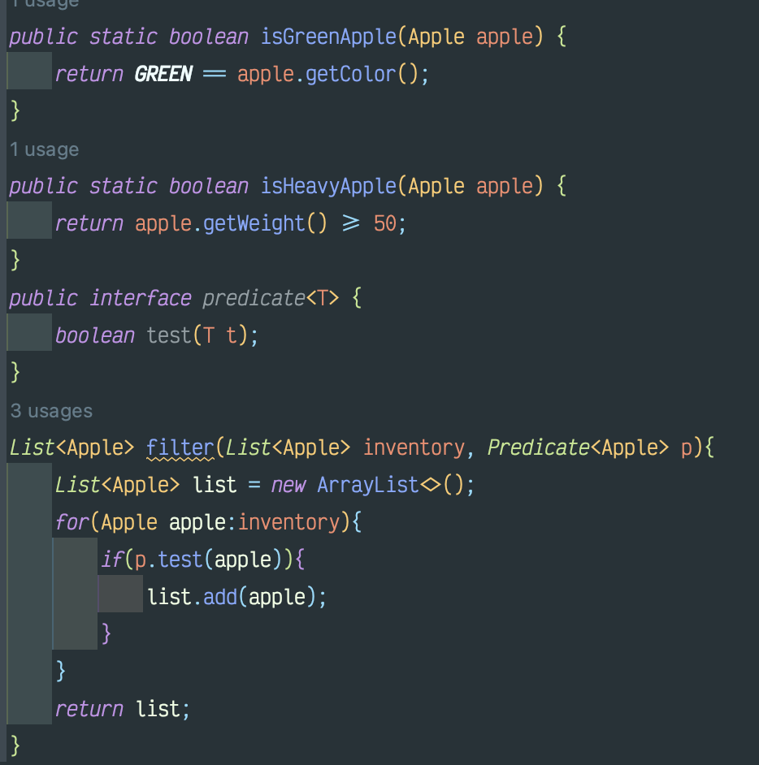
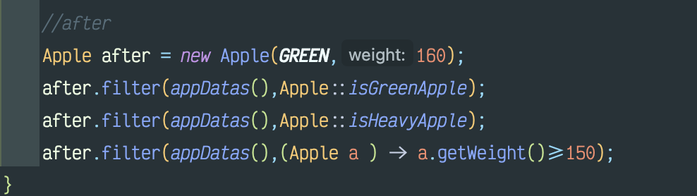
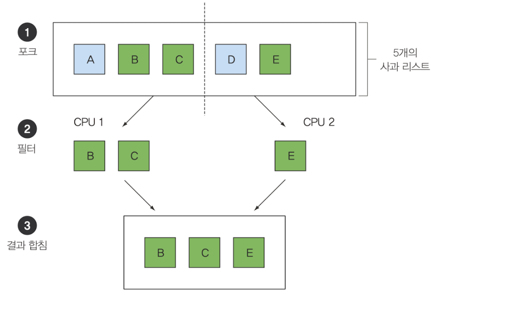
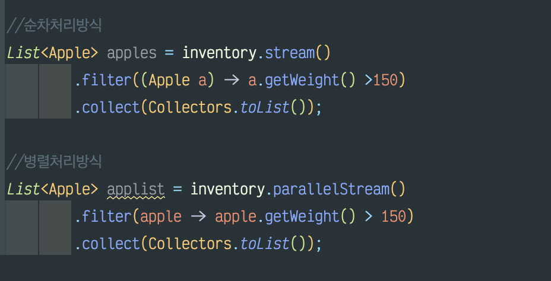

###  메소드 전달 기법 



[기법 적용후 메인 코드]


```text
[느낀점]
interface를 사용해 유연함을 가질수 있는 부분이 인상 깊었고 
익명함수가 있단 사실을 오랜만에 되새김질 하여 다시금 기억에 상기 시킴 
```

## 스트림 
반복되는 패턴으로 주어진 조건에 따라 데이터를 **필터링** -> **추출** -> **그룹화** 




```text
[느낀점]
평소에 사용하던 방법이 순차처리 라는것을 확실히 알게 되었고
병렬처리를 사용하려면 어떤 메소드를 사용해야하는지 알게 되었습
```

### 디폴트 메서드와 자바 모듈
자바 9 의 모듈 시스템은 모듈을 정의하는 문법을 제공
자바 8에서는 인터페이스를 쉽게 바꿀 수 있도록 **디폴트 메소드**를 지원

#### 디폴트 메소드  : 미래에 프로그램이 쉽게 변화할 수 있는 환경을 제공하는 기능

> 어떻게 기존의 구현을 고치지 않고도 이미 공개된 인터페이스를 변경할 수 있을까?

+ 자바 8은 구현 클래스에서 구현하지 않아도 된다. 
+ 메소드 본문은 클래스 구현이 아니라 인터페이스의 일부로 포함된다.(그래서 이를 디폴트 메소드라고 부른다.)

-> 디폴트 메소드를 이용하면 기존의 코드를 건드리지 않고도 원래의 인터페이스 설계를 자유롭게 확장할 수 있다.

> 여러 인터페이스에 다중 이폴트 메소드가 존재할 수 있다는 것은 결국 다중 상속이 허용된다는 의미일까?

-> 엄밀히 다중 상속은 아니지 어느정도는 '그렇다' 라고 말할 수 있다. 

```text
[느낀점]
'미래에 아주 높을 확률로 무엇과 연관관계가 생겨 많은 소통이 있을것이다' 이라는 생각이 
날때 만들것 같다.
```

#### 함수형 프로그래밍

+ 컴퓨터의 거장인 토니 호아레는 "1965년 널 참조를 발명했던 일을 회상하며 '그 결정은 정말 뼈아픈 실수 였다'고 반성하고있다."
+ 자바에서는 NullPointer 예외를 피할 수 있도록 버전 8부터 Optiomal< T > 을 제공합니다. 
