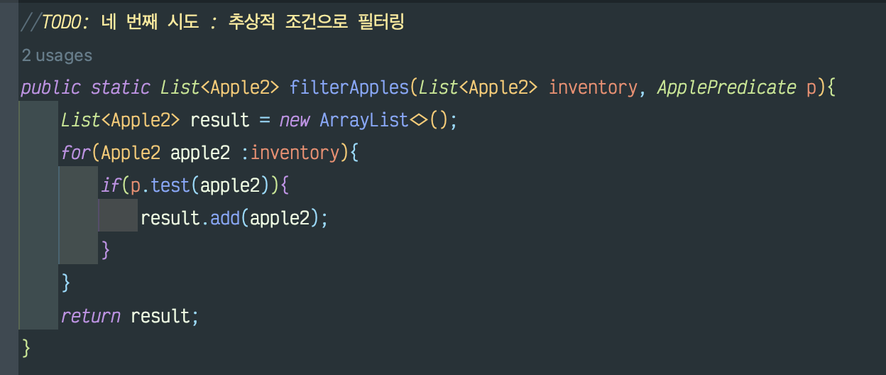
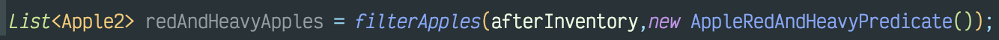
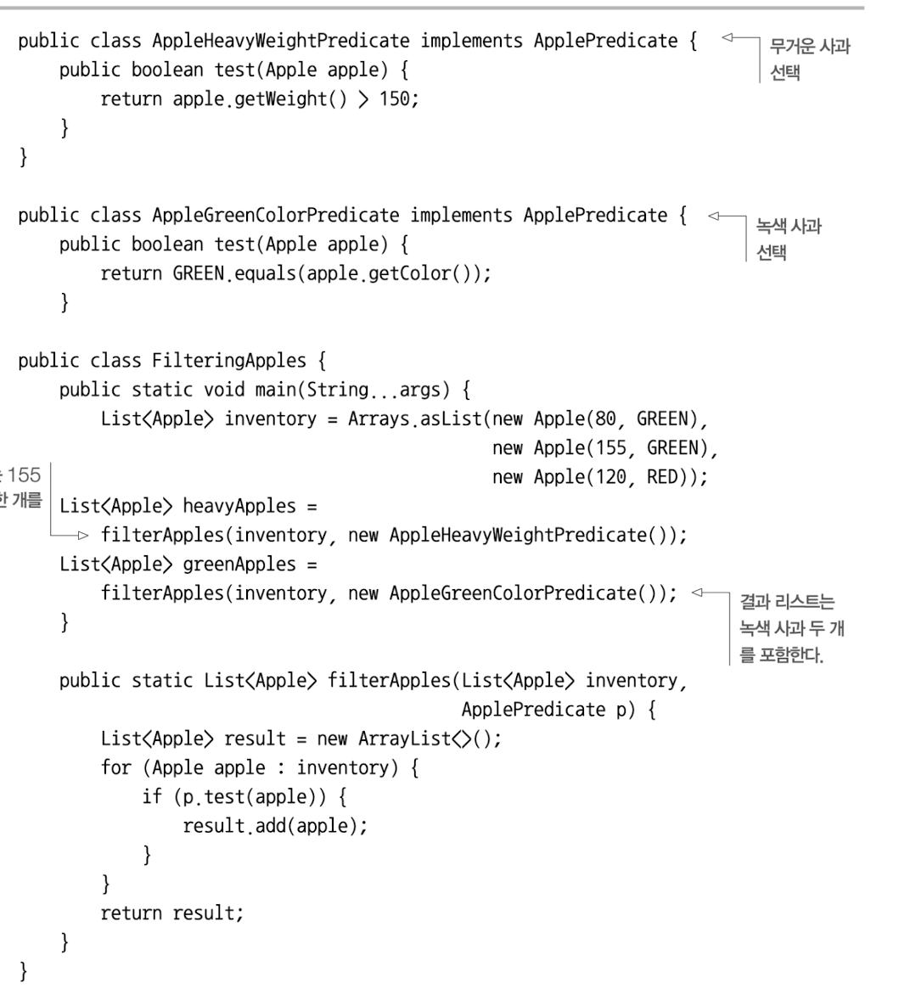
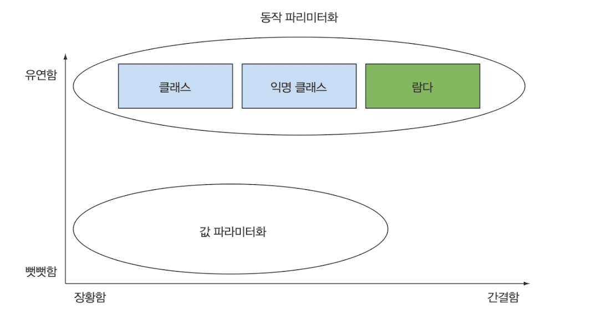
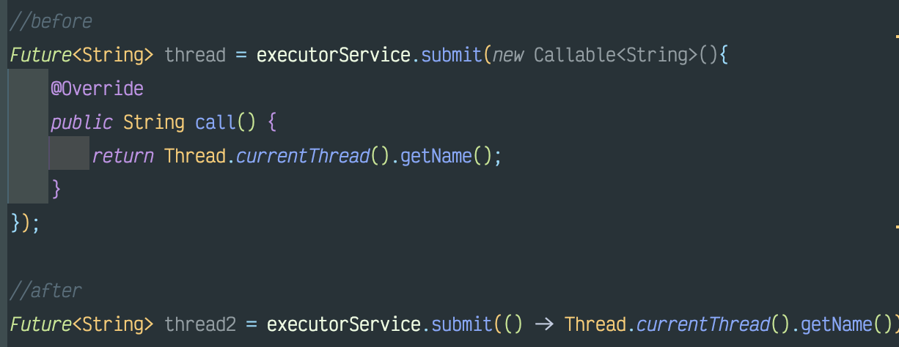

# 동적 마라미터화 코드 전달하기

시시각각 변하는 사용자 요구사항에 대응과 장기적인 관점에서 유지보수 

---
- 변화하는 요구사항에 대응
- 동작 파리미터화
- 익명 클래스 
- 람다 표현식 미리보기
- 실전 예제: Comparator,Runnable GUI 

## 변화하는 요구사항에 대응하기 
**동적 파리미터화** 를 이용하면 요구사항에 효과적으로 대응가능하다.<br>
- [메소드 동작을 파라미터화]


사용

```text
[느낀점]
우와~ 유연함이 장난 아니다. ㄷㄷㄷ
```
### 복잡한 과정 간소화
인터페이스를 구현하는 여러 클래스를 정의한 다음에 인스턴스화 하는 작업은 상당히 번거롭다.
예시

#### 동작 파라미터화의 값 파라미터화 


### Callable을 결과로 반환하기 
ExecutorService 인터페이스는 태스크 제출과 실행 과정의 연관성을 끊어준다.
태스크를 스레드 풀로 보내고 결과를 Future로 저장할 수 있다.

**Callable 인터페이스를 이용해 결과를 반환**

람다식을 활용하면 코드를 줄일 수 있다.


## 마치며
+ 동작 파라미터화에서는 메서드 내부적으로 다양한 동작을 수행할 수 있도록 코드를 메서드 인수로 전달한다.
+ 동작 파라미터화를 이용하면 변화하는 요구사항에 더 잘 대응할 수 있는 코드를 구현할 수 있으며 나중에 엔지니어링 비용을 줄일 수 있다.
+ 코드 전달 기법을 이용하면 동작을 메서드의 인수로 전달 할 수 있다. 하지만 자마8 이전에는 코드를 지저분하게 구현해야 했다.
익명 클래스로도 어느정도 코드를 깔끔하게 만들 수 있었지만 자바8에서는 인터페이스를 상속받아 여러 클래스를 구현해야 하는 수고를 없앨 수 있다.
+ 자바는 수많은 메서드를 동작으로 파라미터화 할 수 있다.


```text
[느낀점]
코드를 줄이는 하나의 기술 겟
```