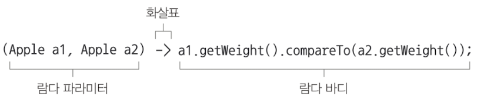
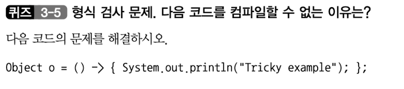
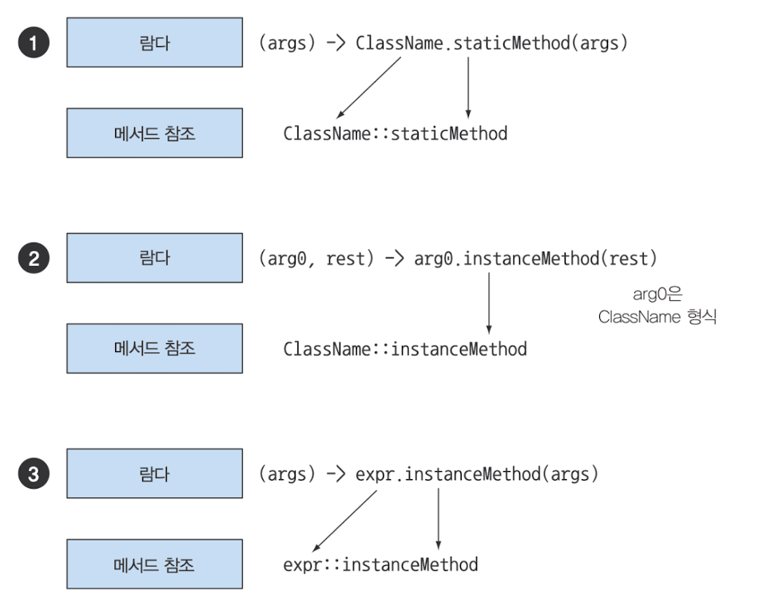
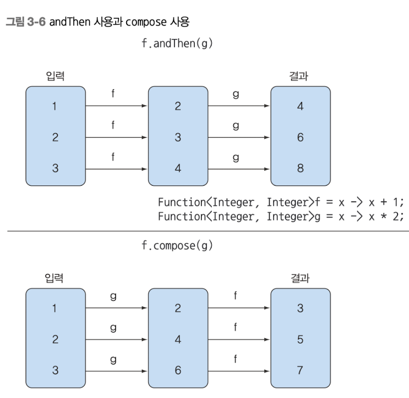

## 람다 표현식
- 람다란 무엇인가.
- 어디에 어떻게 람다를 사용하는가
- 실행 어라운드 패턴
- 함수형 인터페이스,형식 추론
- 메서드 참조
- 람다 만들기

자바 8의 새로운 기능인 람다표현식은 익명 클래스 처럼 이름이 없는 함수이면서
메서드를 인수로 전달 할 수 있음 


람다 표현식에는 이름은 없지만 , 파리미터 리스트,바디 ,반환 형식,예외리스트 는 가질수 있다.

#### 특징
- 익명
- 함수 
- 전달
- 간결성 

**람다**라는 용어는 미적분학 학계에서 개발한 시스템에서 유래함 
결과적으로 코드가 간결하고 유연해진다. 



### 람다 활용 : 실행 어라운드 패턴

1단계 : 동작 파리미터화
2단계 : 함수형 인터페이스를 이용해서 동작 전달
3단계 : 동작 실행 
4단계 : 람다 전달.

### 함수형 인터페이스 사용 
함수형 인터페이스는 오직 하나의 추상 메서드를 지정한다.
함수형 인터페이스의 추상메서드 시그너처를 **함수 디스크럽터** 라고 한다. 

퀴즈
1. T -> R
2. (int, int) -> int
3. T -> void
3. () -> T
4. (T,U) -> R

정답
1: Function<T,R>
2: BinaryOperator<T>
3: Consumer<T>
4: Supplier<T>
5: BiFunction<T,U,R>


### 형식 검사,형식 추론, 제약
람다 표현식을 더 제대로 이해하려면 람다의 실제 형식을 파악해야한다. 

#### 형식 검사.
1. 람다가 사용되는 콘텍스트를 이용해서 람다의 형식을 추론할 수 있다.[**대상형식**]
```text
List<Apple> heavierThan150g = 
filter(inventory,(Apple apple) -> apple.getWeight() > 150);

위 코드 확인 과정
1. filter 메서드 선언을 확인한다.
2. 두 번째 파라미터로 Predicate<Apple> 형식을 기대한다.
3. Predicate<Apple>은 한개의 추상 메서드를 정의하는 함수형 메서드이다.
4.한개의 추상메서드에서 Apple을 받아 boolean을 반환하는 함수 디스크럽터를 묘사한다.
5. filter 메서드로 전달된 인수는 니와 같은 요구사항을 만족해야한다. 
```
2. 같은 람다, 다른 함수형 인터페이스<br>
**대상형식** 이라는 특징 때문에 같은 람다 표현식이더라도 호환되는 추상 메서드를 가진 다른 함수형<br>
인터페이스로 사용된 수 있다.
```text
Callable<Integer> c = () -> 42;
PrivilegedAction<Integer> p = () -> 42;
```


내생각 : 
고정된 최상위 객체 Object는
추상 메서드를 가지고 있지 않음

**정답** : 람다 표현식의 콘텍스트는 대상형식이다.하지만 Object는 함수형 인터페이스가 
아니다 따라서 () -> void 형식의 함수 디스크립터를 갖는 Runnable로 대상 형식을 바꿔서 문제를 해결할 수 있다.
```text
    Runnable r = () -> {Systme.out.println("Tricky example");};
```
명시적으로 대상 형식을 제공하는 Runnable로 캐스팅해서 문제를 해결할 수도 있다.
```text
Object o = (Runnable) () -> {Systme.out.println("Tricky example");};
```

### 메서드 참조
때로는 람다 표현식보다 메서드 참조를 사용하는것이 더 가독성이 좋으며 자연스러울 수 있다.

before
> inventory.sort((Apple a1,Apple a2) -> a1.getWeight().compareTo(a2.getWeight()));

After
> inventory.sort(comparing(Apple::getWeight));

#### 만드는 방법
##### 정적 메서드 참조
##### 다양한 형식의 인스턴스 메서드 참조
##### 기존 객체의 인스턴스 메서드 참조

sample
1. **다양한 형식의 인스턴스 메서드 참조**
```text
    //before
    (String s) -> s.toUpperCase();
    
    //after
    (String::toUpperCase)
```
2. **기존 객체의 인스턴스 메서드 참조**
```text
    //before
    expensiverTransaction.getValue();
    
    //after
    expensiverTransaction::getValue
```


_ 생성자 참조도 된다._
```text
before
Supplier<Apple> c = () -> new Apple();

after
Supplier<Apple> c = Apple::new
```
```text
before
Supplier<Apple> c = (weight) -> new Apple(weight);

after
Supplier<Apple> c = Apple::new
```

#### Pridicate 인터페이스
- negate 결과 반전
- and 두 프레디케이트를 연결해서 새로운 객체를 만듬 
- or 조건 연결

#### Function 조합 
- 람다 표현식 조합 
- 인터페이스를 반환 하는 andThen,Compose 디폴트 메서드를 제공

<br>**[andThen]**
  - 다른 함수의 입력으로 전달하는 함수를 반환
```text
    Function<Integer,Integer> f = x -> x + 1;
    FUnction<Integer,Integer> g = x -> x * 2;
    Function<Integer,Integer> h = f.andThen(g);
    int result = h.apply(1); // -> 4
``` 
<br>**[compose]**
인수로 주어진 함수를 먼저 실행한 다음에 그결과를 외부 함수의 인수로 제공
```text
    Function<Integer,Integer> f = x -> x + 1;
    FUnction<Integer,Integer> g = x -> x * 2;
    Function<Integer,Integer> h = f.compose(g);
    int result = h.apply(1); // -> 3 
```

: 흐름 h.apply();
f.compose(g) ->
g 대상 형식 사용 ( x -> x * 2 ) ->
f 대상 형식 사용 ( x -> x + 1 ) ->
