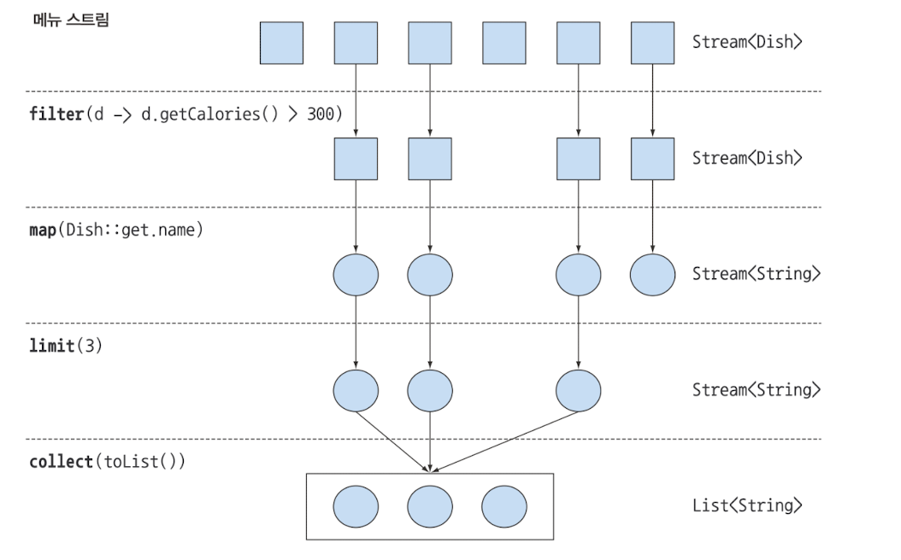
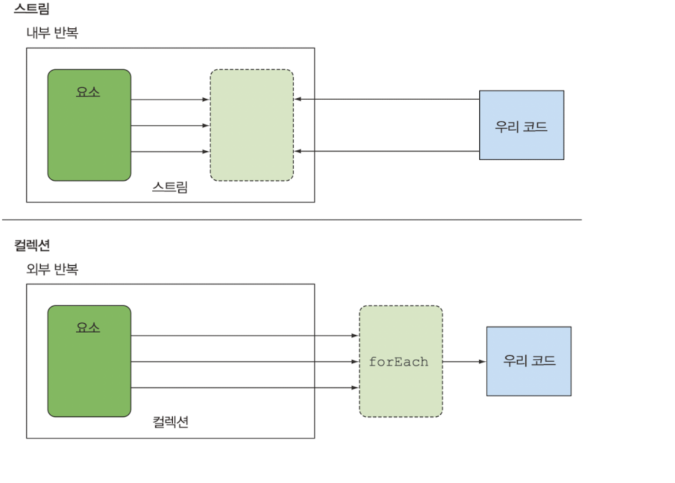
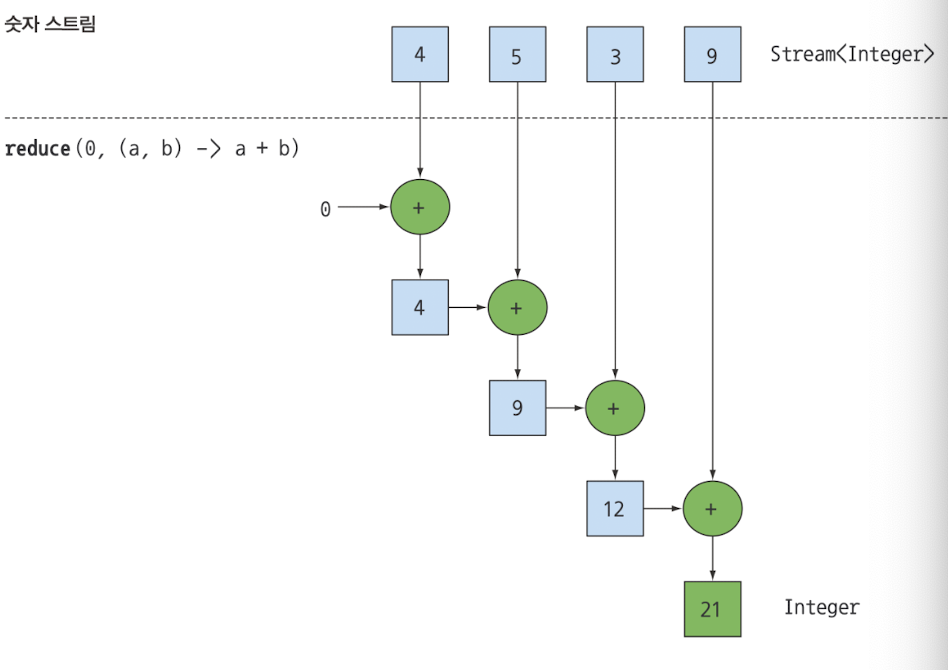

## 스트림 소개

스트림이란 **'데이터 처리 연산을 지원하도록 소스에서 추출된 연속된 요소'**

#### 두가지 특징

- **파이프라이닝**
- **내부 반복**

#### 작업

- filter : 특정 요소 제외 시킴
- map  : 한 요소를 다른 요소로 변환 하거나 정보를 추출
- limit : 스트림 크기를 축소
- collect : 다른 형식으로 변환



### 컬렉션과 차이점

- 저장,계산 순서
    - 컬렉션은 선 저장, 후 계산
    - 스트림은 선 계산, 후 저장
- 외부,내부 반복
    - 컬렉션은 외부
    - 스트림은 내부



### 활용

#### 필터링

##### 프레디케이트로 필터링

프레디케이트(Boolean 을 반환하는 함수)를 인수로 받아서 일치하는 요소를 포함하는 스트림
```text
List<Dish> vegetarianMenu = menu.stream()
                                  .filter(Dish::isVegetarian)
                                  .collect(toList());
```
---

##### 고유 요소 필터링

스트림은 고유 요소로 이루어진 스트림을 반환하는 distinct() 를 지원한다 <br>
distinct() 의 고유 여부는 객체의 hashCode,Equals로 결정 된다.

리스트를 모두 짝수를 선택하고 중복을 필터링
```text
List<Integer> number = ...;
number.stream()
.filter(i -> i%2 == 0)
.distinct()
.forEach(System.out::println);  
```

#### 스트림 슬라이싱

요소를 선택하거나 스킵하는 방법들
- 처음 몇개를 무시하는 방법
- 특정 크기로 스트림 줄이기 등등 

자바 **9** 은 스트림 요소를 효과적으로 선택 할 수 있도록
takeWhile, dropWhile

##### TAKEWHILE 활용

칼로리 320 이하 요리 선택하기
```java
List<Dish> filterMenu = specialMenu.stream()
        .filter(dish -> dish.getCalories() < 320)
        .collect(toList());
```

이중 문제가 생기면 반복이 중단 될수 있다.
그럴때 아래를 이용해서하면 무한스트림을 포함한 모든 스트림에 프레디케이트를 적용해<br>
슬라이스 할 수 있다.
```java
List<Dish> sliceMenu = specialMenu.stream()
        .takeWhile(dish -> dish.getCalories() < 320)
        .collect(toList());
```

##### DROPWHILE 활용

나머지 요소를 선택하여면 어떻게 해야할까<br>
320보다 큰 요소는 어떻게 탐색할까

```java
List<Dish> sliceMenu = specialMenu.stream()
        .dropWhile(dish -> dish.getCalories() < 320)
        .collect(toList());
```

**[ drop while ]** : 프레디케이트가 처음으로 거짓이 되는 지점까지 발견된 요소를 버린다.
프레디케이트가 거짓이 되면 그 지점에서 작업을 준단하고 남은 모든 요소를 반환한다.
무한한 남은 요소를 가진 무한 스트림에서 동작함

**[ Take While ]** : drop while 과 반대로 작업

#### 스트림 축소

limit(n) 메서드 지원 

```java
List<Dish> dishes = specialMenu.stream()
        .filter(dish -> dish.getCalories() > 320)
        .limit(3)
        .collect(toList());
```

#### 요소 건너뛰기

처음 n개 요소를 제외한 스트림을 반환 
skip(n) 메서드 지원


### 매핑 ( .map)

특정 객체에서 특정 데이터를 선택하여 작업할 수 있다. (**변환**,**매핑**)

- 새로운 요소로 매핑되는 과정에서 기존값을 변환하여 새롭게 매핑함
  (dish -> dish.getName) 이동작 수행시 name 타입을 가진 스트림이매핑됨 


```java
words.stream()
        .map(word -> word.split(""))
        .distinct()
        .collect(toList());
```
위 결과 수행하면 

Input : ["Hello","Word"] <br>
Output: (Stream<String[]> ["H","e","l","l","o","W","o","r","d"]

->  (Stream<String>) 으로 하는 방법은? .flatMap() 활용하여 해결

```java
words.stream()
        .map(word -> word.split(""))
        .flatMap(Arrays::Stream)
        .distinct()
        .collect(toList());
```

flatMap은 각 배열을 스트림이 아니라 스트림의 콘텐츠로 매핑이된다. 


## 검색과 매칭

allMatch, anyMatch, noneMatch, FindFirst, findAny 등 다양한 유틸리티 메서드 제공

> **잠깐!.** 프레디케이트란 boolean 타입을 반환타입을 가진 함수

---
#### anyMatch

- 프레디케이트가 적어도 한 요소와 일치하는지 확인
- anyMatch는 Boolean을 반환하는 최종 연산이다.
```java 
if(menu.stream().anyMatch(Dish::isVegetarian))
```
---
#### allMatch
+ 프레디케이트가 적어도 모든 요소와 일치하는지 검사
```java
if(menu.stream().allMatch(dish->dish.getCalories() < 1000))
```

---
#### noneMatch
+ allMatch와 반대 연산을수행
+ 일치하는 요소가 없는지 확인
```java
if(menu.stream().noneMatch(d -> d.getCalories() >= 1000))
```

> 위 세 메서드는 스트림 쇼트서킷 기법, 즉 자바의 && || 와 같은연산에 활용됨


#### findAny 
+ 요소 검색
+ 임의의 요소로 반환 한다.
```java
Optinal<Dish> dish = 
menu.stream()
        .filter(Dish::isVegetarian)
        .findAny();
```

> 스트림 파이프 라인은 내부적으로 단일 과정으로 실행할수 있도록 최적화 된다.
> 즉 쇼트서킷을 이용해서 결과를 찾는 즉시 실행을 종료한다. 그럼 위코드는?

#### findFast
+ 첫 번째 요소 찾기 
+ 논리적인 아이템 순서 

> findFirst,findAny 메서드는 왜 필요할까?
> 바로 병렬성 때문이다 
> 병렬 실행에서 첫 번째 요소를 찾기 어렵다. 따라서 요소의 반환 순서가 상관없다면
> 병렬스트럼에서는 제약이 적은 findAny를 사용한다. 


### 리듀싱(reduce)
+ reduce는 두개의 인수를 갖는다.
+ 초기값 0
+ 두 요소를 조합해서 새로운 값을 만드는 BinaryOperator<T> 사용

```java
int sum = numbers.stream()
        .reduce(0, (a , b)  -> a + b);
```




리듀스(reduce)연산을 이용해서
+ '메뉴의 모든 칼리리의 합계를 구하시오'
+ 메뉴에서 칼로리가가장 높은 요리는

#### 람다식과 조합

```java
int sum = numbers.stream().reduce(0,Integer::sum);
```


#### 초기값 없음

 초기값을 받지않고 사용할 수 있다 하지만 Optional<T> 을 사용해야한다.

```java
Optinal<T> sum = numbers.stream().reduce((a,b) -> (a+b ));
```


#### 최소값 최대값

reduce를 이용해 구해보자

Optional<Integer> max = numbers().stream().reduce(Integer::max);

Optional<Integer> min = numbers().stream().reduce(Integer::min);


### 숫자형 스트림

```java
int calories = menu.stream()
        .map(Dish:;getCalories)
        .reduce(0,Integer::sum)
```

위 코드는 사실 박싱 비용이 있습니다. 

```java
int sum = menu.stream()
        .map(Dish::getCalor)
        .sum()
```

위 코드는 메서드를 직접 호출할 수 없습니다.

스트림의 요소형식은 Integer지만 인터페이스에는 sum메서드가 없습니다.
하지만 stream 에는 map to (type)int 가 있습니다.

.mapToInt()

이때 타입은 Stream<Integer> 가 아니라 IntStream 이 반환 됩니다. 기리고 기본값은 0 입니다. 

기본값 : optionalint

만약 최대값이 0인 상황이 있으면 잘못 된 결과가 나올수 있다.

이때 값이 존재하는지 여부를 가리킬 수 있는 존재가 
Optional 에 있다
- OptionalInt
- OptionalDouble
- OptionalLong
 
## ~Stream (IntStream,LongStream...)

### 객체 스트림 복원하기
Stream<Integer> stream = intStream.boxed();

### 숫자 범위 
IntStream
.rangeClosed(1,100)  // 1~100 범위
.filter(n -> n%2 == 0)     // 짝수 

> filter를 사용해서 결과를 얻을 수 없다.
> 추가 적인 마무리 작업이 필요하다.

intstream.count()  // : 50


#### 집합 생성
stream.filter(b -> Math.sqrt(a*a + b*b) % 1 == 0)
.map( b -> new int[]{a,b ,(int) Math.sqrt(a*a + b*b)});


##### 자바 9에서는 null이 될 수 있는 객체로 스트림을 만들수 있습니다.

만약 System.getProperty 에서 키에 대응하는 속성이 없으면 null을 반환 합니다.
보통 삼향연산자,메소드 로 분리하는데 

자바9 부터는 아래처럼 만들 수 있다. <br>
Stream<String> stream = streams.ofNullable(System.getProperty("Home"));

Stream<String> values = Stream.of("config","home","user")
.flatMap(key -> Stream.ofNullable(System.getProperty(key)));


## 파일로 스트림 만들기 

파일을 처리하는 동의 I/O 연산에 사용하는 자바의 NIO API(비블록 I/O)도 스트림을 사용할 수 있다

```java
try(Stream<String> lines = Files.lines(Path.get("data.txt"),
        Charset.defaultCharset())){
            long uniqueWords = lines.flatMap(line -> Arrays.stream(line.split(" ")))
                .distinct()
                .count();
}catch(IOException e){}


```

